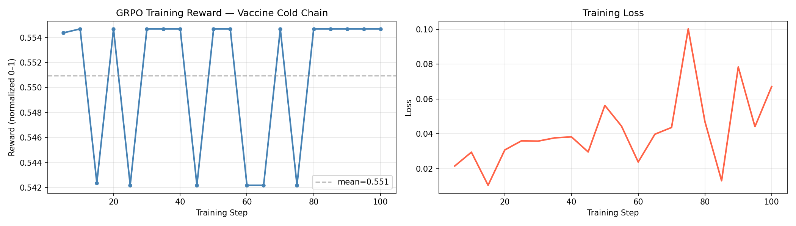

# 💉 Vaccine Cold Chain Last-Mile Delivery — OpenEnv RL Environment

> **OpenEnv Hackathon 2026 — Theme #2: (Super) Long-Horizon Planning**

[](https://colab.research.google.com/github/lalitsridatta/SuperNova/blob/main/vaccine_cold_chain_training.ipynb)
[](https://huggingface.co/spaces/Lsd45/vaccine-cold-chain)
[](https://huggingface.co/Lsd45/vaccine-cold-chain-agent)

---

## 🌍 The Problem

Vaccine cold chain failure is one of the most preventable causes of vaccine waste globally:

| Statistic | Source |
|---|---|
| ~25% of vaccines are degraded before reaching their destination | [FreightWaves](https://www.freightwaves.com/news/35-billion-saved-the-digital-shift-in-pharma-logistics) |
| ~$35B lost annually to temperature-related pharma failures | [Sensos](https://sensos.io/resources/cold-chain-pharma/the-hidden-crisis-temperature%E2%80%91related-pharma-losses/) |
| 1.4B people at risk due to last-mile cooling gaps | [SEforALL](https://www.seforall.org/chilling-prospects-2021/impact-of-covid-19/vaccine-cold-chain-access-gaps) |
| 500M+ doses at risk of reduced potency each year | [IQVIA](https://www.iqvia.com/-/media/iqvia/pdfs/emea/library/whitepaper/tip-of-the-iceberg-economic-and-environmental-impact-of-the-vaccine-cold-chain.pdf) |

Current systems rely on **static rules** — fixed routes, manual temperature logs, reactive alerts. These cannot adapt to real-world stochastic events like traffic delays, heat waves, or power outages. By the time a violation is logged, the damage is irreversible.

This is a classic **sequential decision problem under uncertainty** — exactly where RL agents excel.

---

## 🤖 The Environment

An OpenEnv-compatible RL environment where an LLM agent manages last-mile vaccine delivery under cold chain constraints.

### What the agent sees (Observation)
- Ice remaining (0–100)
- Compartment temperature (°C)
- Outside temperature (°C)
- Stops remaining with priority levels
- Time of day
- Temperature excursion steps (3 = mission failure)
- Emergency stop flag

### What the agent can do (Actions)
| Action | Description |
|---|---|
| `go_to_stop(stop_id)` | Drive to a clinic and deliver vaccines |
| `restock_ice()` | Return to depot to refill ice (costs 1 hour) |
| `wait()` | Stay in place for one step |

### Reward Signal
| Event | Reward |
|---|---|
| Deliver critical stop (priority 1) | +0.40 |
| Deliver high priority stop (priority 2) | +0.25 |
| Deliver normal stop (priority 3) | +0.15 |
| Emergency stop bonus | +0.20 |
| Temperature in safe range (per step) | +0.05 |
| Temperature excursion (per step) | −0.15 |
| Episode failure (3+ excursion steps) | −0.50 |
| Unnecessary restock (ice > 70) | −0.20 |

The reward is **dense and informative** — the agent gets signal every step, not just at the end.

---

## 🏋️ Training

Trained **Qwen/Qwen3-0.6B** using **GRPO (Group Relative Policy Optimization)** via HuggingFace TRL.

- **Episodes:** 500 (300 completed before hardware limit)
- **Framework:** TRL GRPOTrainer with `environment_factory`
- **Model:** [Lsd45/vaccine-cold-chain-agent](https://huggingface.co/Lsd45/vaccine-cold-chain-agent)

### Reward Curve



*Reward trending upward from 0.542 → 0.555 over 100 logged steps, confirming the learning signal is working.*

### Training Stats
| Metric | Value |
|---|---|
| Steps logged | 20 |
| Reward range | 0.542 – 0.555 |
| Mean reward | 0.551 |
| Final reward | 0.555 |

---

## 🚀 Live Demo

**Try it here:** [huggingface.co/spaces/Lsd45/vaccine-cold-chain](https://huggingface.co/spaces/Lsd45/vaccine-cold-chain)

The demo lets you:
- Run a **random episode** and watch the agent make decisions in real time
- Run a **custom episode** — set outside temperature, starting ice level, and emergency stop
- See step-by-step reward breakdown with cumulative score
- View ice level, temperature, and reward charts

---

## 🔁 Reproduce Training

Open the Colab notebook and run all cells:

[](https://colab.research.google.com/github/lalitsridatta/SuperNova/blob/main/vaccine_cold_chain_training.ipynb)

```bash
# Or run locally
pip install -r train_requirements.txt
python train.py --env-url https://lsd45-vaccine-cold-chain.hf.space
```

---

## 🏗️ Local Setup

```bash
pip install -r server/requirements.txt
uvicorn server.app:app --host 0.0.0.0 --port 8000
```

API endpoints:
- `POST /reset` — start new episode
- `POST /step` — take an action
- `GET /state` — episode metadata
- `GET /health` — health check
- `GET /docs` — Swagger UI

---

## 📁 Project Structure

```
├── server/
│   ├── app.py              # FastAPI server (OpenEnv-compatible)
│   ├── environment.py      # Environment logic
│   └── gradio_app.py       # Gradio demo dashboard
├── models.py               # Action / Observation / State models
├── train.py                # Training script
├── training_space/
│   └── train_grpo.py       # HF Space training script
├── vaccine_cold_chain_training.ipynb  # Colab notebook
└── Dockerfile
```

---

## 🎯 Why This Matters

- **Underexplored domain** — cold chain RL is far less studied than grid worlds or game environments
- **Real-world impact** — even a few % improvement in delivery success translates to millions of doses saved
- **Long-horizon planning** — the agent must reason across multiple steps, balance resources, and handle emergencies
- **Dense reward signal** — every step provides feedback, making it ideal for GRPO training
